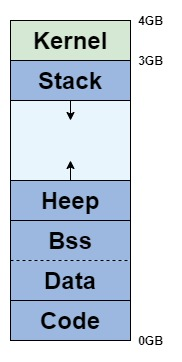

# OS

## 프로세스
프로세스는 **실행 중인 프로그램**을 의미한다.  
프로그램을 실행하면, OS로부터 메모리를 할당받으며, 할당된 메모리 공간으로 바이너리 코드가 올라간다. 

### Process Control Block
프로세스 제어 블록(Process Control Block, PCB)은 **특정 프로세스에 대한 정보를 저장**하고 있는 OS의 자료구조이다. OS는 프로세스를 관리하기 위해 프로세스의 생성과 동시에 고유한 PCB를 생성한다.  
프로세스가 CPU를 할당받아 작업을 처리하다가 프로세스 전환이 발생하면, 진행되던 작업을 PCB에 저장하고 CPU를 반환한다. 이후 다시 CPU를 할당받게 되면, PCB에 저장되어 있던 내용을 불러와 작업을 재개한다.  

### 프로세스의 메모리 구조
  
프로세스는 4GB의 가상 메모리를 할당받는데, 그 구조는 위와 같다.  
1GB는 커널이 차지하고, 나머지 3GB를 사용자 프로그램이 차지한다.

- Stack 영역
    - 지역 변수, 매개 변수, 리턴 값, 복귀 주소 등이 저장되는 영역이다.
    - 함수 호출이 될 때 새로운 스택 영역이 시작되고, 해당 함수가 종료될 때 생성됐던 데이터들이 해제된다.
- Heap 영역
    - 동적 할당을 위한 메모리 영역이다.
- Bss & Data 영역
    - 전역변수, 스태틱 변수들이 위치하는 영역이다.
    - 초기화가 된 데이터들은 Data 영역에, 초기화되지 않은 영역은 Bss 영역에 저장된다.
        - Bss 영역은 초기화 과정에서 컴파일러에서 지정한 초기화 방식에 의해 초기화
        - Data 영역은 ROM에 있는 초기화된 데이터를 해당 Data 영역으로 복사하여 초기화
- Code 영역
    - 프로그램의 Instruction이 위치하는 곳